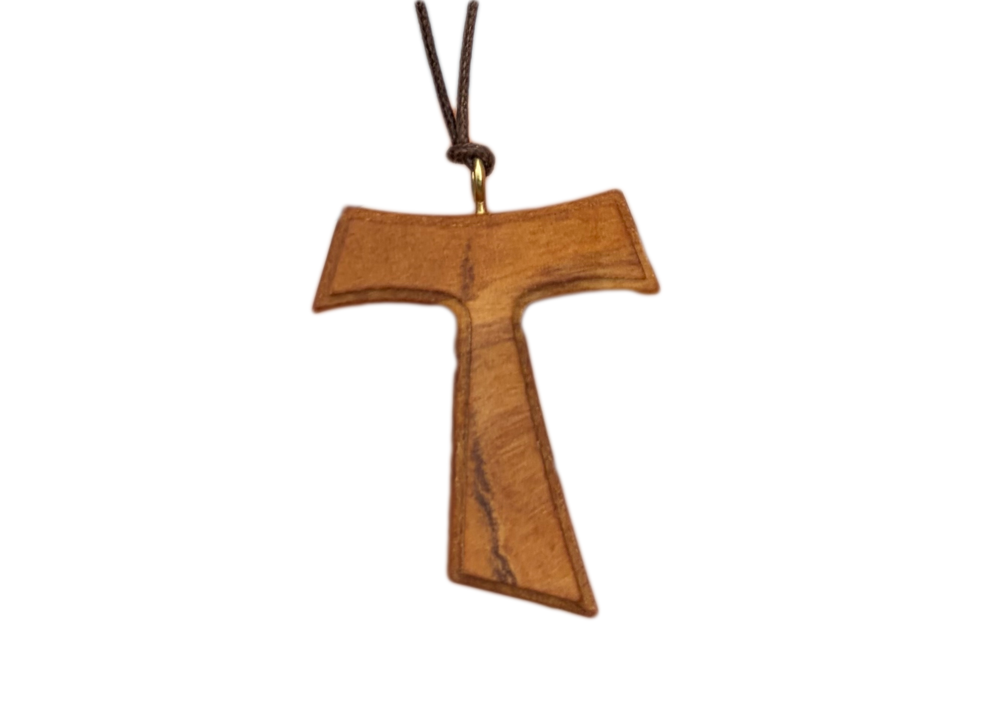

## Character & Description

For out first assignment I found a picture from my archive. It's a letter T made from wood, but also Tau cross because it is shaped like the Greek letter tau and is associated with the Franciscan order and piligrims. We found it in a monastery in Rome. My mom now wears it like a proud pilgrim.  

Picture from my archive

- - -

**Alt text:** A close-up of a 16 point ampersand typed in Trebuchet MS viewed in Illustrator’s Pixel Preview mode.
### Process
