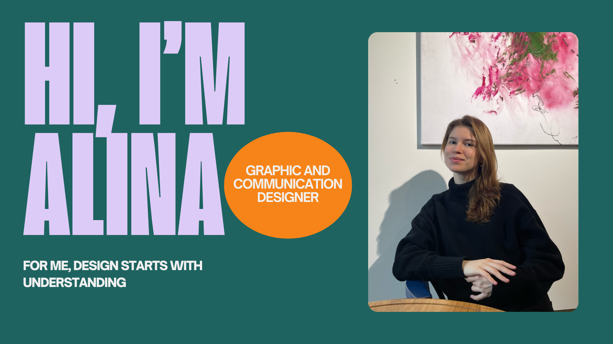
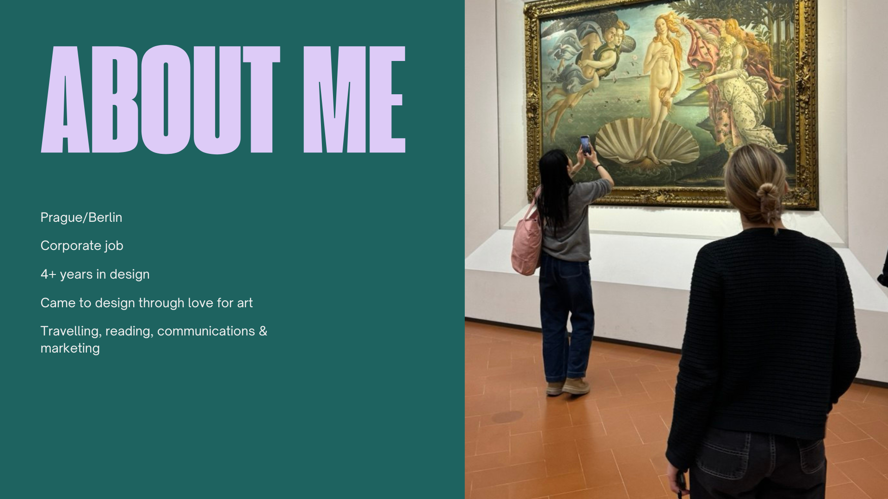
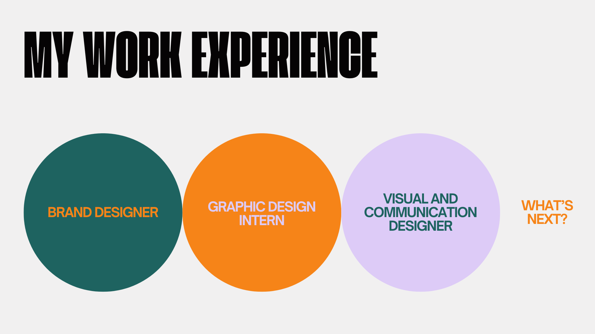
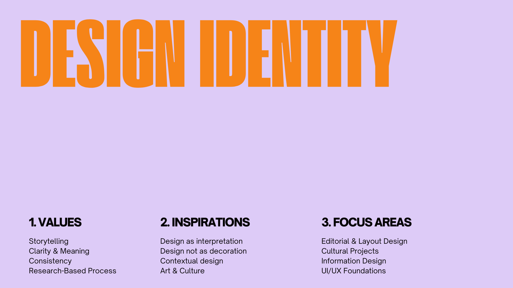
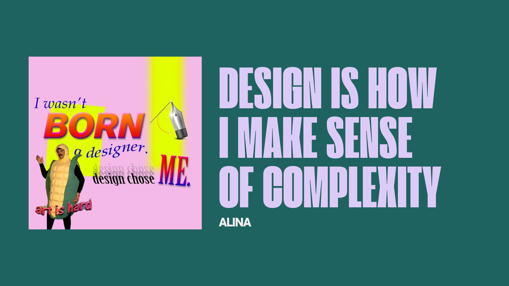

## Self-presentation

A short presentation about myself and my work experience.

**The Hook:** Hi everyone, I’m Alina, a Graphic and Communications Designer. For me, design is never just about aesthetics, it starts with a deep understanding of the problem.

**About Me:** I’m based between Prague and Berlin and have spent over four years working in design, including time in a corporate environment. My journey began with a fundamental love for art, and that creative curiosity extends into my interests in traveling, reading, and marketing.

**My Path:** My professional experience spans various roles, from starting as a Graphic Design Intern to working as a Brand and Visual Designer. I am constantly evolving and looking for the next challenge where I can apply these skills.

**Design Identity:** My identity is built on research-based storytelling, clarity, and consistency. I believe design is interpretation, not decoration. My main focus areas include editorial design, cultural projects, and information design.

**Conclusion:** I wasn’t born a designer—I chose it because I believe art is a powerful, though challenging, tool. Design is how I make sense of complexity in the world around us. Thank you!
