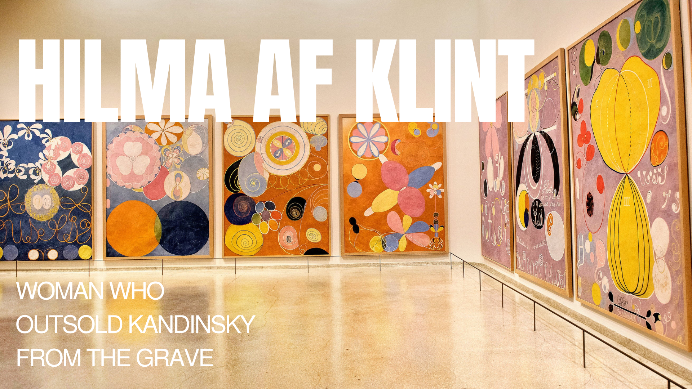
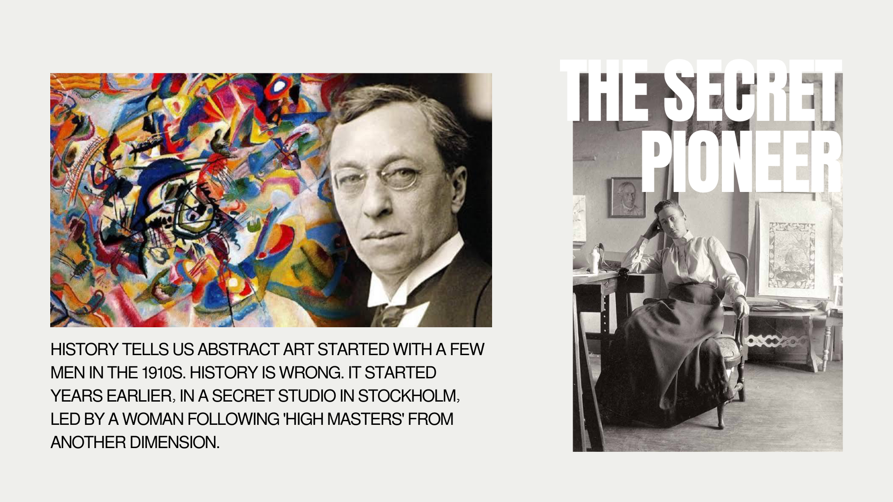
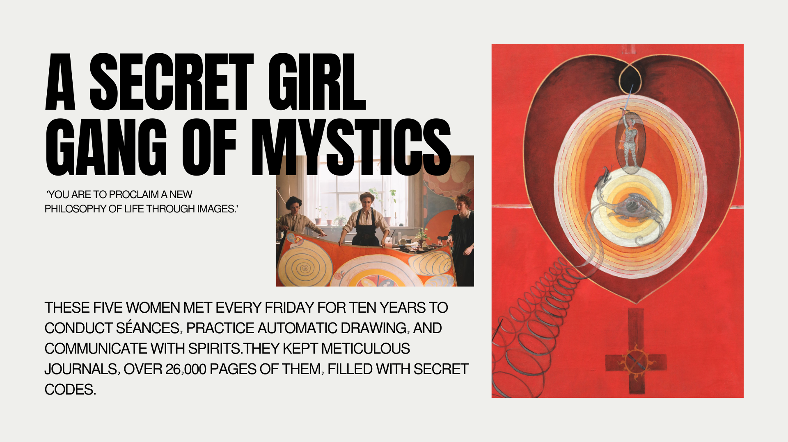
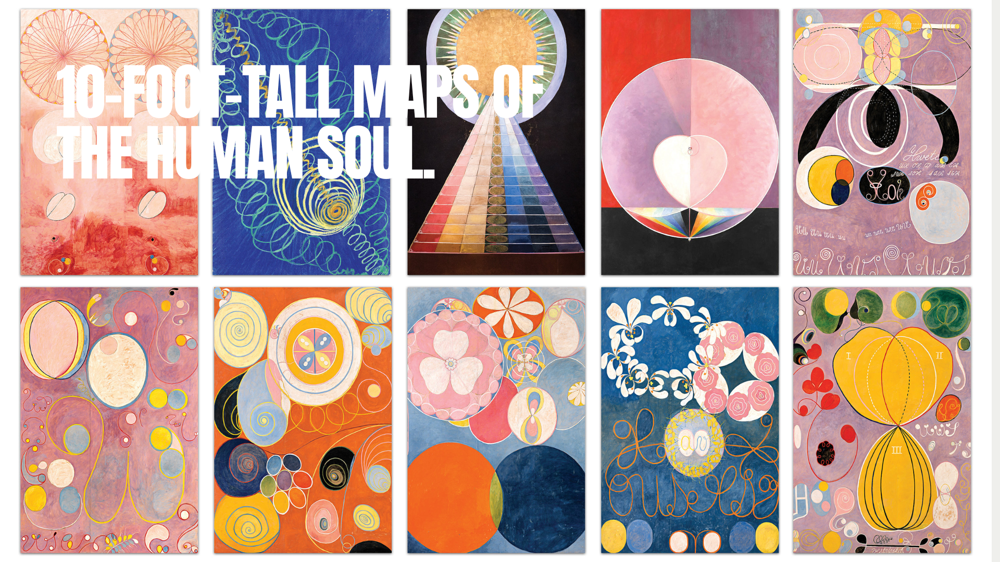
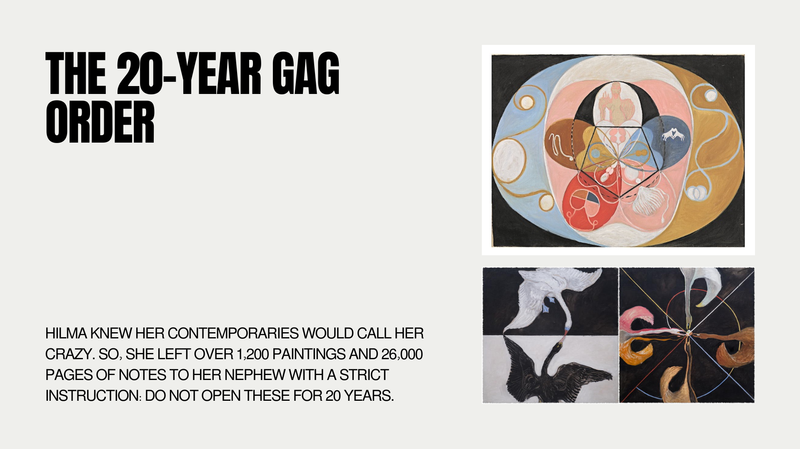
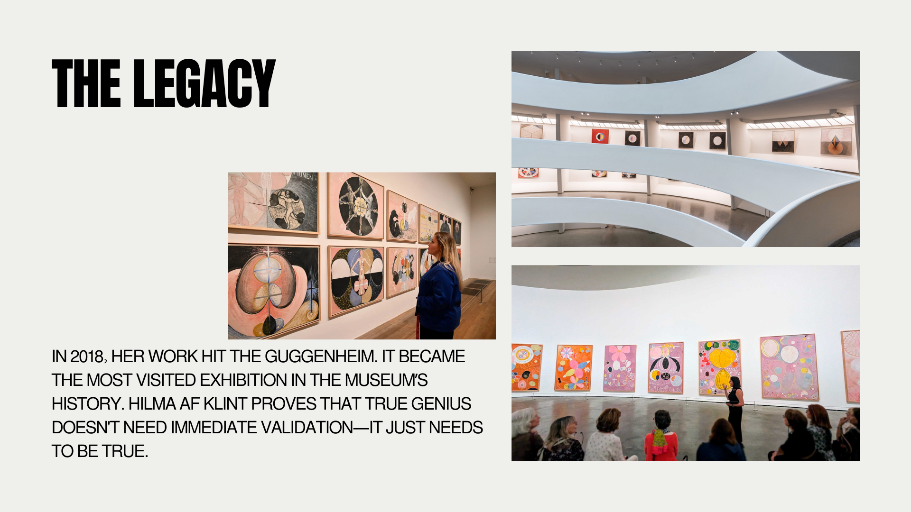

# Hilma af Klint — Talking Points

## Slide 1 — Introduction
- Today I want to talk about Hilma af Klint, an artist who completely changed the story of abstract art.
- She is often called the woman who “outsold Kandinsky from the grave.”
- For a long time, art history credited men like Kandinsky as the inventors of abstraction.
- But Hilma af Klint was creating abstract paintings years earlier, mostly in secret.
- Her story is interesting because it combines art, spirituality, mystery, and the question of who gets remembered in history.

---

## Slide 2 — The Secret Pioneer
- Hilma af Klint was a Swedish artist born in 1862.
- She worked during a time when women artists were often ignored or underestimated.
- According to the presentation, she believed her paintings were guided by “High Masters,” spiritual beings from another dimension.
- This connection to spirituality deeply influenced her art.
- Her abstract works appeared before abstraction became officially recognized in modern art history.
- This challenges the traditional narrative of who “invented” abstract art.

---

## Slide 3 — The Mystical Group “The Five”
- Hilma was part of a spiritual group called “The Five.”
- The group met every Friday for séances, automatic drawing, and spiritual experiments.
- Automatic drawing means creating art without conscious control, almost like letting ideas flow directly from the subconscious.
- They kept extremely detailed journals — over 26,000 pages.
- The women believed art could communicate spiritual truths and a “new philosophy of life.”
- This is important because it connects early abstract art with mysticism and psychology, not just aesthetics.

---

## Slide 4 — The Paintings
- One of the most impressive things about Hilma’s work is the scale.
- Some paintings were over 10 feet tall.
- Her artworks often used symbols, geometry, spirals, circles, and bright colors.
- She described them almost like maps of the human soul.
- The paintings were not meant to simply represent reality, but invisible emotions, spiritual ideas, and inner experiences.
- This makes her work feel surprisingly modern even today.

---

## Slide 5 — The 20-Year Gag Order
- Hilma af Klint understood that people of her time would probably not understand her work.
- Before her death, she instructed her nephew not to show her paintings for 20 years.
- She left behind more than 1,200 paintings and thousands of pages of notes.
- This decision created a mystery around her work and delayed her recognition for decades.
- It also raises an interesting question:
  - Was she protecting her work from criticism?
  - Or did she believe the world simply was not ready yet?

---

## Slide 6 – Legacy and Recognition
- Hilma af Klint became internationally famous long after her death.
- In 2018, her exhibition at the Guggenheim Museum became the most visited exhibition in the museum’s history.
- Today, many historians see her as one of the true pioneers of abstract art.
- Her story also reflects larger issues:
  - how women were excluded from art history,
  - how unconventional ideas are often dismissed at first,
  - and how recognition sometimes comes much later.

---

## Slide 7 — Conclusion
- Hilma af Klint’s story changes the way we think about modern art.
- She proves that innovation can exist outside official history and institutions.
- Her work combines abstraction, spirituality, psychology, and symbolism in a unique way.
- What makes her story powerful is that she created art without immediate validation or fame.
- In the end, her legacy reminds us that important ideas are not always recognized right away.

